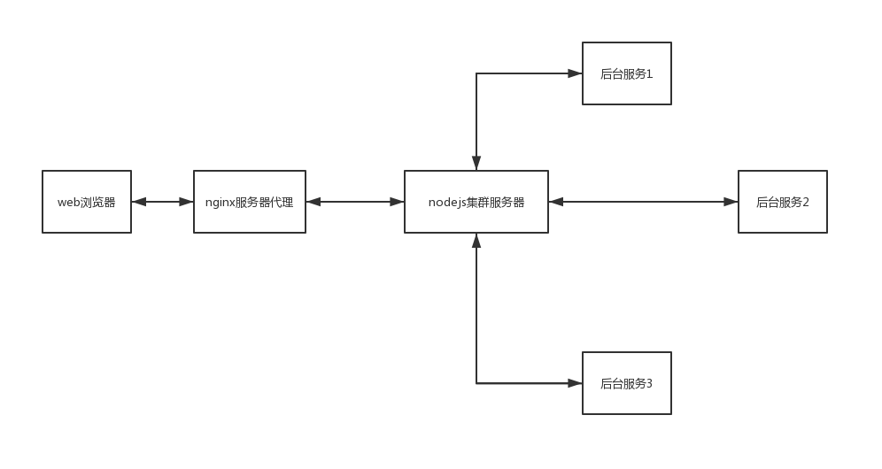

# [QQ空间的web架构](./Qzone.md)

大纲：

- [nodejs服务作为web的接入](#nodejs服务作为web的接入)
- [好处](#好处)
- [新页面上线流程](#新页面上线流程)

## nodejs服务作为web的接入

抽象的架构图：

比如：以查看空间访客页面为例子

- 用户点击了空间访客的链接，向nginx服务器发起了对空间访客页面的请求
- nginx服务器收到请求，把请求转发给nodejs服务器
- nodejs服务器收到请求，从请求中获取了登录的QQ号码，向后台服务x请求访客的数据
- 后台服务x收到nodejs的访客数据的请求，查找数据库等，得到用户的访客详情，把访客详情返回给nodejs服务器
- nodejs收到后台服务x的响应，得到访客的数据，生成访客的html页面，把访客的html页面返回给nginx服务器
- nginx服务器收到访客的html页面，把html页面响应返回给浏览器
- 浏览器得到html页面的响应，渲染出页面，展示给用户看。

## 好处

- nodejs服务器由前端开发管理，后台开发专注在后台服务的提供能力上，即前后端分离
- 开发效率高，可以快速的进行开发和定位问题

## 新页面上线流程

- 本地开发页面，跟后台联调接口等
- 开发完，把代码提交到nodejs测试机器上，产品在测试环境进行体验
- 产品体验，提出体验问题，开发进行体验问题的修复
- 测试介入进行测试，提出bug等，开发进行bug修复
- 没有问题了，发布外网机器，产品和测试在外网验证

流程上：

本地开发 -> 测试环境 -> 外网